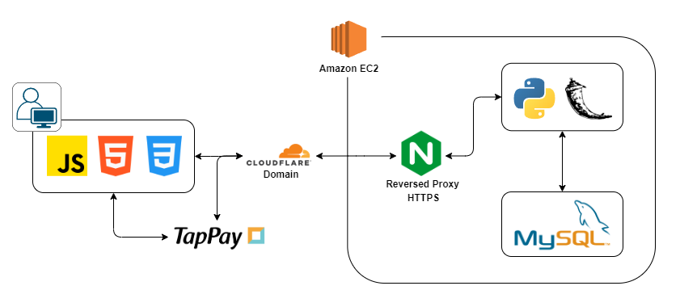
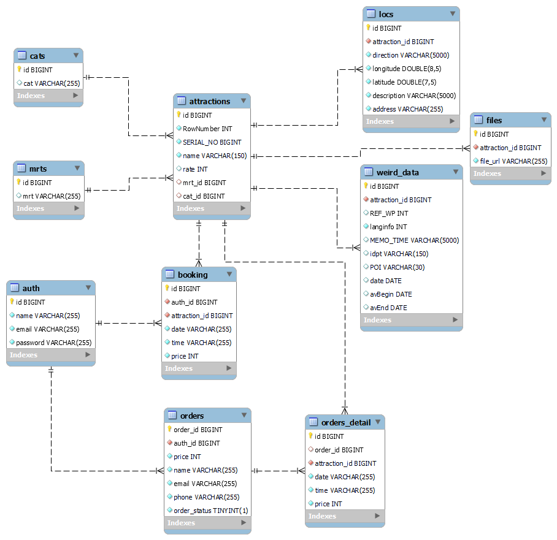

# 台北一日遊

### 預訂屬於您的台北旅遊行程

### 網址: https://www.desire-operator.com/

- 測試帳號：

  - 帳號：test@test.com
  - 密碼：test@test.com

- 付款測試：

  - 卡片號碼：4242-4242-4242-4242
  - 過期時間：04/25
  - 安全碼：123

## 目錄

- [專案架構](#專案架構)
- [特色](#特色)
- [技術說明](#技術說明)
- [資料庫設計](#資料庫設計)
- [技術應用](#技術應用)
- [聯絡方式](#聯絡方式)

## 專案架構

# 特色:

此為 Camp 的共同作業，我的特色如下

1. 參數化 Raw SQL 指令，使用 Python script 建立 Database and tables，且 Flask access API 時也套用同一套方法訪問資料庫。優點是:

   - 用同一套系統管理資料架構，減少介面
   - 集中個別對於資料庫的動作參數，方便比較與修改

2. 目前 DB 中數據量不大，search (select) 時嘗試盡量減少 access DB 的次數，減少重複從 connection pool 中取得 connection 所花 I/O 的時間
3. 不使用框架完成圖片輪轉動畫
   

# 技術說明:

1. 全站皆有 RWD。
2. 後端使用 MVC，且盡量朝向 CSR 設計。
3. 符合 RESTful API。
4. 首頁景點讀取使用 Infinite Scroll。
5. 用三方支付系統 TapPay 處理付費。

## 資料庫設計

- 滿足 3NF。
- 使用外鍵加速聯表搜尋與增加約束提高資料安全性。
  

## 技術應用

- 架構

  - MVC
  - RESTful API

- 後端：

  - Python
  - Flask

- 雲端 (AWS)

  - EC2

- 佈署：

  - Ubuntu

- 資料庫：

  - MySQL

- 連線：

  - HTTPS
  - Nginx
  - JWT

- 前端：

  - JavaScript
  - HTML/CSS

- 開發工具：

  - Git & GitHub

- 三方工具：

  - TapPay

## 聯絡方式

莊子賢 Tzu-Hsien, Chuang  
email： t1375844@gmail.com  
Linkedin：https://www.linkedin.com/in/tzu-hsien-chuang/
